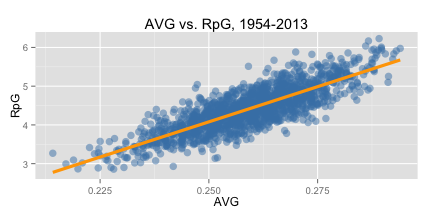
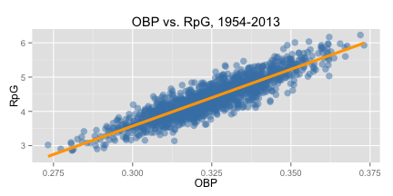

## Overview

hitr is a simple R-powered application that enables the user to explore
relationships between various team offensive baseball statistics and a set of
outcomes.

* Included outcomes: Runs per Game, Winning Percentage

* Included predictors: Batting Average, On-Base Percentage, Slugging Percentage,
On-Base Plus Slugging, Hits per Game, Extra-Base Hits per Game, Home Runs per
Game, Stolen Bases per Game, Basic Runs Created, Isolated Power, Power-Speed
Number

The following example illustrates one exploration that can be performed with hitr.

--- &twocol

## Example: Batting Average vs. On-Base Percentage


*** =left

  


*** =right

* Let's say we want to determine whether batting average or on-base percentage better explains runs scored per game. All we have to do is examine each using hitr, and compare.
* hitr produces plots similar to the ones on this slide, which show the relationships between runs per game and batting average, and runs per game and on-base percentage, respectively, for the period 1954–2013.
* Visually, it appears that the on-base percentage model is a better fit, but let's quantify that observation...

--- &twocol

## Example (continued)

*** =left

#### Batting Average


```r
fitAVG <- lm(RpG ~ AVG, teams)
summary(fitAVG)$adj.r.squared
```

```
## [1] 0.6834
```

<br>

#### On-Base Percentage


```r
fitOBP <- lm(RpG ~ OBP, teams)
summary(fitOBP)$adj.r.squared
```

```
## [1] 0.7968
```


*** =right

* The adjusted R-squared values (which hitr presents alongside the plots) confirm our visual observation, showing that on-base percentage does a much better job explaining runs scored per game than batting average, though if you explore hitr, you'll see that there are other much better predictors of runs per game.

* This type of exploration is valuable, because it encourages us to question our understanding of how the game works, and allows us to see that reality is not always consistent with conventional thinking.

---

## Areas for Further Development

* So far, hitr only uses offensive statistics, and therefore only addresses half of the game of baseball. The logical next step would be to include defensive statistics. Though a pitching module would be relatively straightforward, a fielding module (the other component of defense) would be much more difficult. Available fielding statistics are relatively poor, so the picture of defensive drivers of success would likely be less clear than that of offensive drivers.

* Another logical improvement would be to look at the impacts of individual player statistics on team runs scored/allowed or team wins. This would be feasible, as the data is available, though it would require additional data processing and cleaning.


<style>
.title-slide {
  background-color: #555;
}

.title-slide hgroup > h1{
 font-family: 'Oswald', 'Helvetica', sanserif;
}

.title-slide hgroup > h1,
.title-slide hgroup > h2,
.title-slide hgroup > p {
  color: #EEE ;
}

slide:not(.segue)  h2{
  color: steelblue;
}

</style>
